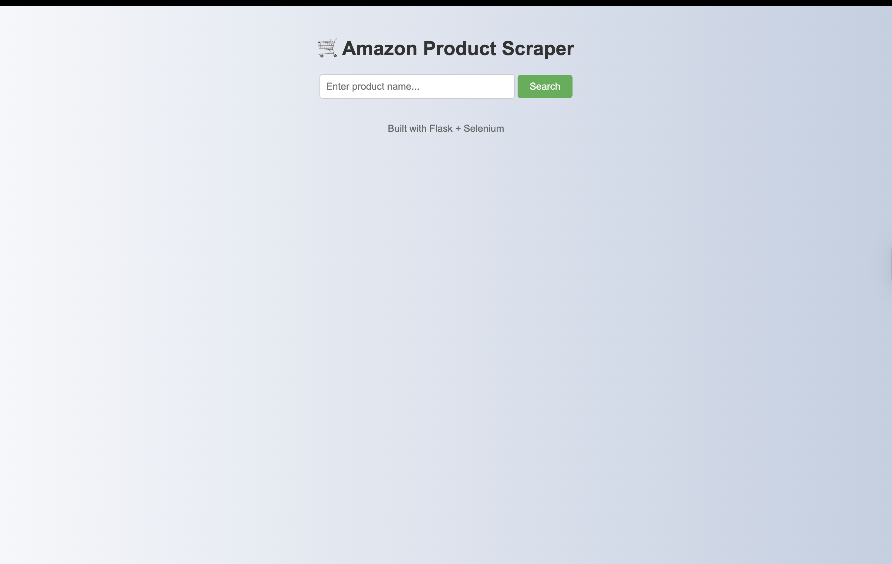
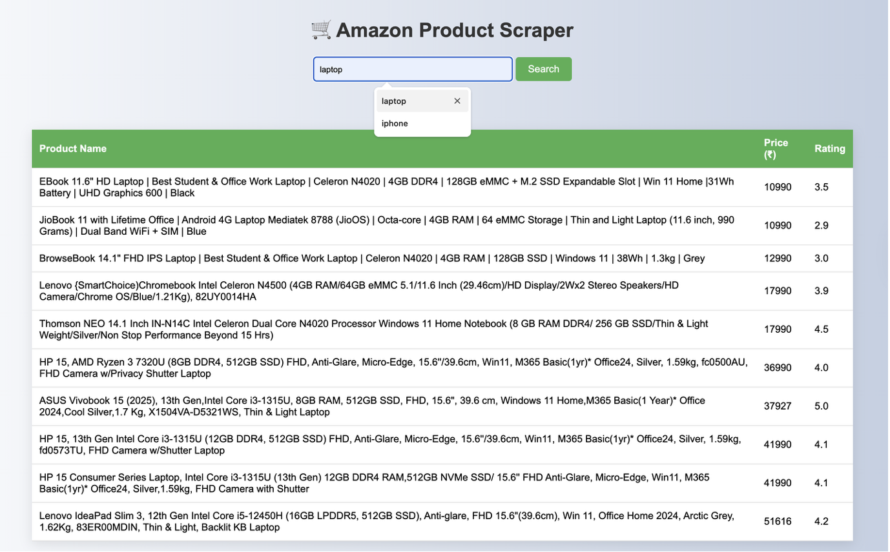

# SCT_SD_4

# Ecommerce Scraper

## Description
This project is a Python program that extracts product information such as **names, prices, and ratings** from online e-commerce websites and stores the data in structured CSV files. It allows users to collect and analyze product data efficiently.

---

## Features
- Scrapes product **names**, **prices**, and **ratings**.  
- Supports exporting data to **CSV files** for easy analysis.  
- Simple and easy-to-use Python script.  

---

## Installation
1. Clone the repository:

```bash
git clone https://github.com/amrutadeokarcomp23-source/SCT_SD_4.git
cd SCT_SD_4

## images





